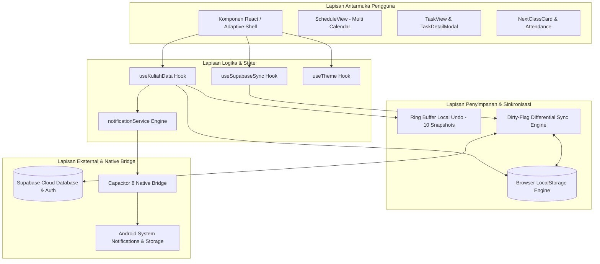

<p align="center">
  
</p>

# KuliahPlanner

Sistem manajemen perkuliahan terpadu berbasis arsitektur *local-first* dan multi-platform (Web & Android). Dirancang untuk memberikan keandalan tinggi dalam pengelolaan jadwal semester, pelacakan tugas akademik, pemantauan batas kehadiran presensi, serta penjadwalan notifikasi pengingat secara mandiri dan persisten.

<p align="left">
  <a href="https://github.com/Tederby/KuliahPlanner/releases"></a>
  <a href="https://github.com/Tederby/KuliahPlanner/actions"></a>
  <a href="https://github.com/Tederby/KuliahPlanner/releases"></a>
  
  
</p>

<p align="left">
  <a href="https://github.com/Tederby/KuliahPlanner/releases/tag/v1.0.0"><strong>Unduh File APK Resmi</strong></a> &bull;
  <a href="https://kuliah-planner.vercel.app/"><strong>Akses Live Demo Web</strong></a> &bull;
  <a href="public/privacy.html"><strong>Kebijakan Privasi</strong></a> &bull;
  <a href="public/terms.html"><strong>Syarat Layanan</strong></a>
</p>

---

## Daftar Isi

1. [Ikhtisar Sistem](#ikhtisar-sistem)
2. [Prinsip Keandalan Sistem](#prinsip-keandalan-sistem)
3. [Distribusi Aplikasi Android](#distribusi-aplikasi-android)
4. [Spesifikasi Fitur Utama](#spesifikasi-fitur-utama)
5. [Arsitektur Sistem & Alur Data](#arsitektur-sistem--alur-data)
6. [Keamanan & Integritas Data](#keamanan--integritas-data)
7. [Panduan Instalasi & Pengoperasian Lokal](#panduan-instalasi--pengoperasian-lokal)
8. [Alur Kompilasi & CI/CD Android](#alur-kompilasi--cicd-android)
9. [Struktur Direktori Repositori](#struktur-direktori-repositori)
10. [Matriks Kompatibilitas Platform](#matriks-kompatibilitas-platform)
11. [Lisensi & Ketentuan](#lisensi--ketentuan)

---

## Ikhtisar Sistem

KuliahPlanner dibangun untuk mengatasi kendala fragmentasi jadwal kuliah dan risiko kelalaian tugas akademik yang kerap dialami mahasiswa. Sebagian besar aplikasi kalender konvensional menuntut koneksi internet aktif secara konstan atau memerlukan konfigurasi manual yang repetitif untuk setiap sesi pertemuan mingguan.

KuliahPlanner menerapkan pendekatan rekayasa modern:
- **Penyusunan Jadwal Semester Otomatis**: Algoritma cerdas yang menghasilkan seluruh sesi pertemuan selama 14 hingga 16 minggu perkuliahan hanya dari input jadwal induk mingguan, lengkap dengan pemisahan kalender UTS dan UAS.
- **Kemandirian Offline (Offline-First Resiliency)**: Seluruh operasi data berpusat di penyimpanan lokal perangkat. Sistem tetap dapat diakses dan dimanipulasi secara penuh tanpa sambungan jaringan.
- **Sinkronisasi Multi-Perangkat Terkendali**: Memanfaatkan Supabase Backend-as-a-Service dengan skema autentikasi kredensial langsung dan pelacakan perubahan diferensial (*dirty-flag tracking*) untuk mencegah penimpaan data yang tidak disengaja.
- **Integrasi Perangkat Keras Seluler**: Menggunakan Capacitor 8 untuk menghadirkan performa aplikasi native pada sistem operasi Android, termasuk penjadwalan alarm notifikasi lokal yang bekerja pada tingkat sistem tanpa server pihak ketiga.

---

## Prinsip Keandalan Sistem

Keandalan (*reliability*) merupakan pilar utama dalam desain arsitektur KuliahPlanner:

1. **Zero Data Loss Guarantee**: Setiap mutasi data (penambahan, perubahan, penghapusan) langsung diverifikasi dan dicatat ke dalam `localStorage` dengan penanganan galat sinkron.
2. **Local Undo Buffer**: Sistem mencatat riwayat snapshot lokal hingga 10 transaksi terakhir menggunakan struktur data *ring buffer*. Tindakan destruktif dapat dipulihkan secara instan melalui antarmuka notifikasi toast interaktif.
3. **Konflik Sinkronisasi Transparan**: Ketika terjadi perbedaan versi antara penyimpanan lokal dan cloud Supabase, sistem tidak melakukan penimpaan data secara sepihak. Dialog perbandingan data disajikan kepada pengguna untuk memilih versi yang valid atau melakukan penggabungan data.
4. **Validasi Input Ketat**: Semua formulir masukan data (mata kuliah, jadwal, waktu SKS, deadline tugas) dilindungi oleh modul validator deterministik untuk mencegah inkonsistensi tipe data dan rentang waktu.
5. **Deteksi Bentrok Jadwal (*Clash Warning*)**: Kalkulator waktu otomatis menghitung durasi jam selesai berdasarkan bobot SKS dan memberi peringatan visual sebelum jadwal yang tumpang tindih disimpan.

---

## Distribusi Aplikasi Android

Aplikasi Android resmi didistribusikan dalam format biner APK (*Android Application Package*) yang siap dipasang secara mandiri (*sideloading*).

### Spesifikasi Biner Rilis v1.0.0

| Parameter | Nilai Spesifikasi |
| :--- | :--- |
| Versi Rilis | v1.0.0 |
| Application ID / Package | `com.tederby.kuliahplanner` |
| Nama Berkas Biner | `KuliahPlanner-v1.0.0.apk` |
| Minimum Android Version | Android 7.0 (API Level 24) |
| Target & Compile SDK | Android 16 (API Level 36) |
| Runtime Framework | Capacitor 8.4 & Android Native Platform |
| Jalur Unduhan Resmi | [GitHub Releases KuliahPlanner](https://github.com/Tederby/KuliahPlanner/releases/tag/v1.0.0) |

### Prosedur Instalasi pada Perangkat Android

1. **Unduh Berkas APK**: Buka tautan rilis resmi di atas melalui peramban pada perangkat Android Anda, kemudian unduh berkas `KuliahPlanner-v1.0.0.apk`.
2. **Otorisasi Pemasangan Berkas**: Jika sistem menampilkan dialog *Install unknown apps* atau *Sumber tidak dikenal*, berikan izin sementara kepada peramban atau pengelola berkas Anda.
3. **Selesaikan Proses Pemasangan**: Tekan tombol *Pasang* (*Install*) dan tunggu hingga proses verifikasi paket selesai.
4. **Konfigurasi Izin Notifikasi**: Pada Android 13 (API Level 33) ke atas, setujui permintaan izin notifikasi (*POST_NOTIFICATIONS*) saat pertama kali membuka aplikasi agar pengingat sesi kelas dan batas waktu tugas dapat berjalan secara tepat waktu.

---

## Spesifikasi Fitur Utama

### 1. Kalender Akademik Multi-Tampilan
- **Tampilan Bulan (Month View)**: Ikhtisar kepadatan agenda dalam skala bulanan dengan indikator visual tanggal hari ini dan pelabelan warna mata kuliah yang harmonis.
- **Tampilan Pekan (Week View)**: Kisi waktu horizontal dengan pembagian jam komprehensif, banner tugas prioritas di bagian atas, dan tombol penambahan tugas cepat per kolom hari.
- **Tampilan Harian (Day View)**: Navigasi fokus harian dengan rincian jadwal kelas dan slot kegiatan non-akademik.
- **Tampilan Agenda (Agenda View)**: Daftar kronologis urut waktu yang menampilkan seluruh pertemuan mendatang dan tenggat waktu tugas yang aktif.
- **Navigasi Hirarkis & Breadcrumb**: Navigasi transisi yang mulus dari Month ke Week dan Day view dengan riwayat navigasi interaktif.

### 2. Manajemen Tugas & Agenda Kegiatan
- **Dukungan Dua Kategori Utama**: Pemisahan tegas antara tugas mata kuliah resmi dan agenda kegiatan mandiri (rapat himpunan, seminar, workshop).
- **Klasifikasi Tugas Kelompok vs Individu**: Fasilitas pencatatan nomor kelompok kerja beserta daftar nama anggota kelompok.
- **Renderer Markdown**: Kolom deskripsi tugas mendukung format teks terstruktur (tebal, miring, monospace code, daftar butir, dan kutipan) secara aman.
- **Penghitung Waktu Mundur (Countdown Timer)**: Peringatan visual sisa waktu pengerjaan (jam/hari) serta penanda status keterlambatan (*overdue*).
- **Sistem Penyaringan Terpadu**: Pemfilteran instan berdasarkan status penyelesaian (Aktif, Selesai, Semua), tipe data, dan per mata kuliah.

### 3. Pemantauan Presensi & Ambang Batas Kehadiran
- **Pencatatan Riwayat Pertemuan**: Status kehadiran komprehensif untuk setiap sesi (Hadir, Izin, Alpa).
- **Kalkulator Ambang Ketidakhadiran**: Perhitungan matematis kuota ketidakhadiran maksimal yang diizinkan (standar toleransi institusi 25% atau konfigurasi kustom) guna memitigasi risiko pembatalan hak ujian akhir semester (UAS).

### 4. Kartu Status Waktu Nyata (Next Class Card)
- **Pelacak Sesi Berjalan**: Tampilan kartu pintar yang mendeteksi kelas yang sedang berlangsung hari ini disertai bilah kemajuan (*live progress indicator*).
- **Proyeksi Sesi Mendatang**: Menampilkan waktu jeda menuju kelas berikutnya pada hari yang sama secara otomatis.

### 5. Penyesuaian Jadwal & Reschedule Buffer (Stash System)
- **Pemisahan Sesi Tertunda**: Memindahkan sesi pertemuan yang batal atau ditunda oleh dosen ke dalam buffer penampungan sementara (*stash*).
- **Penjadwalan Ulang Presisi**: Menentukan tanggal dan waktu pengganti secara terisolasi tanpa mengacaukan konfigurasi jadwal induk mata kuliah.

### 6. Layanan Notifikasi Lokal Mandiri (Offline Notifications)
- **Pengingat Sesi Kelas**: Pemicu alarm pengingat sebelum kelas dimulai (dapat dikonfigurasi 10, 15, atau 30 menit sebelumnya).
- **Daily Academic Briefing**: Rangkuman otomatis jadwal kuliah dan daftar deadline tugas yang dikirimkan setiap pukul 07.00 waktu lokal.
- **Peringatan Tenggat Tugas**: Notifikasi batas waktu pengerjaan tugas 3 jam sebelum deadline berakhir.
- **Operasional Tanpa Server**: Seluruh jadwal notifikasi didaftarkan langsung ke penjadwal alarm native sistem operasi melalui `@capacitor/local-notifications`.

### 7. Mesin Tema & Aksesibilitas Visual
- **Mode Tampilan Dinamis**: Deteksi preferensi tema sistem operasi (*Auto*), mode Terang (*Light*), dan mode Gelap (*Dark*) dengan proteksi anti-kedip (*anti-FOUC*).
- **Sistem Palet Warna Dinamis**: Penyesuaian token warna antarmuka ke berbagai spektrum warna (Indigo, Emerald, Crimson, Amber, Cyan, Violet, Monochrome) atau kode HEX kustom.
- **Pewarnaan Mata Kuliah Otomatis**: Algoritma alokasi warna independen untuk setiap mata kuliah yang menjamin keterbacaan tinggi pada kalender.

---

## Arsitektur Sistem & Alur Data

KuliahPlanner mengadopsi pola arsitektur *unidirectional data flow* yang dipisahkan menjadi modul logika, lapisan penyimpanan persisten, dan jembatan native.



### Rincian Alur Sinkronisasi Data

1. Setiap mutasi data di sisi klien menandai state dengan penanda perubahan (*dirty flag*).
2. Mesin sinkronisasi melakukan perbandingan nomor versi (*timestamp & revision hashing*) antara snapshot lokal dan rekaman di tabel cloud Supabase.
3. Apabila status cloud lebih baru dan tidak ada modifikasi lokal yang bertentangan, sistem melakukan *fast-forward merge*.
4. Apabila terdeteksi konflik konkurensi (data lokal dan remote sama-sama dimodifikasi sejak sinkronisasi terakhir), antarmuka `SyncConflictModal` akan diaktifkan untuk resolusi eksplisit oleh pengguna.

---

## Keamanan & Integritas Data

- **Kedaulatan Data Lokal**: Seluruh data akademik Anda tersimpan di media penyimpanan internal perangkat Anda. Tidak ada data yang dikirimkan ke pihak luar tanpa tindakan otentikasi eksplisit dari pengguna.
- **Autentikasi Mandiri Tanpa Ketergantungan**: Sinkronisasi cloud menggunakan skema akun kredensial langsung (Username dan Password terenkripsi) pada basis data Supabase, meminimalkan risiko pelacakan lintas platform pihak ketiga.
- **Pemisahan Akses Tingkat Baris (Row-Level Security / RLS)**: Pada sisi database Supabase, kebijakan RLS PostgreSQL memastikan bahwa setiap pengguna hanya memiliki izin baca, tulis, dan hapus terhadap data miliknya sendiri.
- **Portabilitas Data Penuh**: Fitur Ekspor dan Impor berkas JSON terstruktur memungkinkan pencadangan (*backup*) mandiri kapan saja tanpa penguncian vendor (*no vendor lock-in*).

---

## Panduan Instalasi & Pengoperasian Lokal

### Prasyarat Sistem

- **Node.js**: Versi LTS 18.x atau 22.x
- **Package Manager**: npm versi 9.x atau yang lebih baru
- **Peramban Modern**: Google Chrome, Mozilla Firefox, Microsoft Edge, atau Safari (versi rilis 2 tahun terakhir)
- **Java Development Kit (JDK)**: Versi 21 (diperlukan hanya jika melakukan build Android secara lokal)
- **Android Studio & SDK**: Android SDK Build-Tools 36 (opsional, hanya untuk kompilasi lokal Android)

### Langkah-Langkah Instalasi

1. Kloning repositori proyek dari GitHub:
   ```bash
   git clone https://github.com/Tederby/KuliahPlanner.git
   cd KuliahPlanner
   ```

2. Pasang seluruh dependensi proyek:
   ```bash
   npm install
   ```

3. Konfigurasi Variabel Lingkungan:
   Salin berkas contoh konfigurasi `.env.example` menjadi `.env`:
   ```bash
   cp .env.example .env
   ```
   Buka berkas `.env` dan masukkan kredensial proyek Supabase Anda:
   ```env
   VITE_SUPABASE_URL=https://proyek-anda.supabase.co
   VITE_SUPABASE_ANON_KEY=kunci-anonim-publik-supabase-anda
   ```
   *(Catatan: Jika Anda hanya ingin menggunakan fitur offline lokal tanpa sinkronisasi multi-device, konfigurasi Supabase dapat dikosongkan).*

4. Jalankan server pengembangan lokal:
   ```bash
   npm run dev
   ```
   Buka alamat `http://localhost:3000/` pada peramban Anda.

5. Kompilasi Produksi Web:
   ```bash
   npm run build
   npm run preview
   ```
   Hasil berkas bundel siap produksi akan ditempatkan pada direktori `dist/`.

---

## Alur Kompilasi & CI/CD Android

### 1. Otomatisasi Terintegrasi (GitHub Actions CI/CD)

Repositori ini telah dikonfigurasi dengan alur kerja otomatisasi di `.github/workflows/build-android.yml`. Setiap pembuatan tag rilis baru (`v*`) atau pemicuan manual via GitHub Actions akan secara otomatis:
- Menyiapkan environment Node.js 22 dan Java Temurin JDK 21.
- Mengompilasi bundel web Vite dan menyinkronkan aset ke folder native Android (`npx cap sync android`).
- Menjalankan Gradle Wrapper untuk memproduksi berkas biner `KuliahPlanner-vX.X.X.apk`.
- Menerbitkan rilis resmi dan mengunggah biner APK ke GitHub Releases.

### 2. Kompilasi Lokal Melalui Terminal

Untuk melakukan kompilasi manual pada komputer pengembang:

```bash
# 1. Pastikan bundel web terkini telah dibangun
npm run build

# 2. Sinkronkan berkas web ke platform Android
npx cap sync android

# 3. Kompilasi biner debug APK menggunakan Gradle
cd android
./gradlew assembleDebug
```

Berkas keluaran APK yang dihasilkan berada pada jalur:
`android/app/build/outputs/apk/debug/app-debug.apk`

Untuk membuka proyek di lingkungan Android Studio IDE:
```bash
npx cap open android
```

---

## Struktur Direktori Repositori

```
KuliahPlanner/
├── .github/
│   └── workflows/
│       └── build-android.yml    # Konfigurasi otomasi build & rilis APK GitHub Actions
├── android/                     # Proyek native Android (Capacitor wrapper & Gradle)
│   ├── app/
│   │   └── build.gradle         # Konfigurasi dependensi dan versi target Android SDK
│   └── variables.gradle         # Definisi versi platform SDK (minSdk 24, compileSdk 36)
├── public/
│   ├── icon.png                 # Berkas grafis ikon resmi aplikasi
│   ├── favicon.png              # Berkas favicon peramban
│   ├── apple-touch-icon.png     # Ikon perangkat layar berdensitas tinggi
│   ├── privacy.html             # Dokumen Kebijakan Privasi
│   └── terms.html               # Dokumen Syarat dan Ketentuan Layanan
├── src/
│   ├── components/              # Komponen antarmuka modular
│   │   ├── AuthModal.jsx        # Dialog autentikasi akun Supabase
│   │   ├── BottomNav.jsx        # Bilah navigasi bawah adaptif untuk platform seluler
│   │   ├── ConfirmDialog.jsx    # Dialog konfirmasi aksi destruktif
│   │   ├── EventModal.jsx       # Dialog interaksi dan penyesuaian detail kelas
│   │   ├── MatkulView.jsx       # Modul konfigurasi semester, data matkul, & cadangan
│   │   ├── MobileHeader.jsx     # Header responsif untuk tampilan layar ringkas
│   │   ├── NextClassCard.jsx    # Kartu waktu nyata kelas berjalan & sesi berikutnya
│   │   ├── OnboardingGuide.jsx  # Panduan interaktif bagi pengguna baru
│   │   ├── ScheduleView.jsx     # Mesin kalender multi-tampilan & sistem breadcrumb
│   │   ├── Sidebar.jsx          # Panel navigasi utama dan status sinkronisasi
│   │   ├── StashView.jsx        # Modul penampungan sementara kelas tertunda
│   │   ├── SyncConflictModal.jsx# Penanganan resolusi konflik versi data
│   │   ├── TaskDetailModal.jsx  # Rincian tugas lengkap dengan hitung mundur deadline
│   │   ├── TaskView.jsx         # Modul pengelola tugas akademik dan agenda acara
│   │   ├── ThemeSwitcher.jsx    # Pengaturan palet warna dan mode gelap/terang
│   │   └── ToastContainer.jsx   # Pengelola pemberitahuan toast dengan aksi pemulihan
│   ├── hooks/                   # Custom hooks untuk orkestrasi state
│   │   ├── useCalendarEvents.js # Transformasi data jadwal ke struktur kalender
│   │   ├── useKuliahData.js     # State store utama (CRUD, verifikasi, undo buffer)
│   │   ├── useSupabaseSync.js   # Manajemen daur hidup autentikasi dan sinkronisasi
│   │   ├── useTheme.js          # Mesin kalkulasi palet warna dinamis & sistem tema
│   │   └── useToast.js          # State notification dispatcher
│   ├── utils/                   # Utilitas deterministik & layanan sistem
│   │   ├── courseColors.js      # Generator palet warna dan detektor bentrok jadwal
│   │   ├── dateUtils.js         # Manipulasi dan standarisasi format tanggal lokal
│   │   ├── markdown.js          # Parser markdown sederhana dan aman untuk deskripsi
│   │   ├── notificationService.js# Pengelola pendaftaran alarm notifikasi native
│   │   ├── storage.js           # Lapisan abstraksi persistensi localStorage & JSON
│   │   ├── supabase.js          # Inisialisasi klien Supabase dan pembungkus API
│   │   ├── undoHistory.js       # Implementasi ring buffer pemulihan lokal
│   │   └── validators.js        # Validasi struktur data dan batas masukan
│   ├── App.jsx                  # Komponen akar dan orkestrasi layout adaptif
│   ├── index.css                # Konfigurasi Tailwind CSS dan token desain
│   └── main.jsx                 # Titik masuk eksekusi React DOM
├── capacitor.config.json        # Konfigurasi dasar Capacitor runtime
├── package.json                 # Metadata paket dan daftar dependensi npm
├── tailwind.config.js           # Konfigurasi tema dan utilitas tata letak Tailwind
└── vite.config.js               # Konfigurasi bundler Vite
```

---

## Matriks Kompatibilitas Platform

| Lingkungan Pengujian | Target Platform | Status Dukungan | Catatan Teknis |
| :--- | :--- | :--- | :--- |
| Google Chrome | Desktop & Seluler | Teruji Penuh | Performa optimal, dukungan Web Storage API penuh |
| Mozilla Firefox | Desktop & Seluler | Teruji Penuh | Akselerasi tata letak kisi dan kepatuhan standar CSS |
| Microsoft Edge | Desktop & Seluler | Teruji Penuh | Mesin Chromium dengan kompatibilitas penuh |
| Apple Safari | macOS & iOS (Web) | Teruji | LocalStorage persisten dalam batasan kebijakan WebKit |
| Android Native APK | Android 7.0 s/d 16 | Teruji Penuh | Dukungan notifikasi lokal offline dan adaptasi hardware back |

---

## Lisensi & Ketentuan

Proyek ini dirilis dan didistribusikan di bawah lisensi terbuka [MIT License](https://opensource.org/licenses/MIT). Anda memiliki kebebasan penuh untuk meninjau, mengadaptasi, memodifikasi, serta mendistribusikan kode sumber ini untuk keperluan pendidikan maupun personal.

Untuk informasi kebijakan penanganan data pribadi dan ketentuan pemakaian layanan, silakan merujuk pada dokumen resmi berikut:
- [Dokumen Kebijakan Privasi (Privacy Policy)](public/privacy.html)
- [Dokumen Syarat & Ketentuan Layanan (Terms of Service)](public/terms.html)